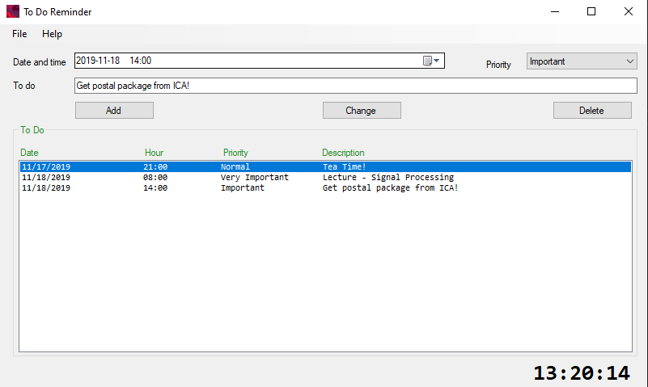

# ToDoList

ToDoList is a simple application developed as part of an assement for the course DA204E - Programming in C#.
The applicaton allows you to create simple reminders for upcomming tasks that you need to perform. The UI is intuitive and simple allowing you to add, edit and delete tasks.
